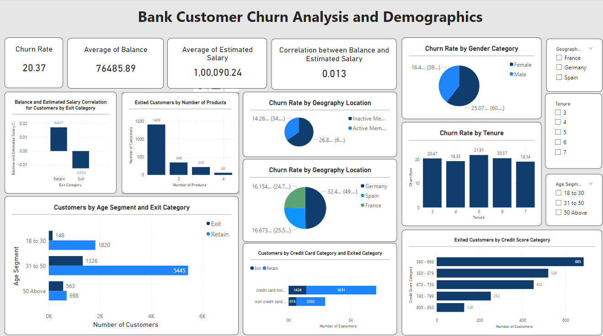

# Customer Churn Analysis for Retail Bank

# SQL | Power BI | Business Insights | Data Analytics Case Study

# 📌 Business Problem

Customer churn directly impacts revenue and customer lifetime value in the banking industry.

The objective of this project is to:

Analyze customer behavior patterns

Identify key drivers of churn

Segment high-risk customers

Provide actionable retention recommendations

This project simulates a real-world Data Analyst assignment for a retail banking client.

# 📊 Dataset Description

The dataset consists of structured banking CRM data across multiple tables:

CustomerInfo – Customer demographics and account details

Bank_Churn – Churn status (Exited vs Retained)

ActiveCustomer – Customer activity indicators

CreditCard – Credit card ownership information

Geography – Regional data

Gender – Gender mapping

Total Records: ~10,000 customers

# 🧹 Data Processing (SQL)

Using SQL, the following steps were performed:

Joined multiple CRM tables

Cleaned and validated categorical values

Calculated churn rates by segment

Created derived metrics for analysis

Aggregated KPIs for dashboard reporting

# 📈 Key Analytical Insights
1️⃣ Regional Impact

Certain geographies show significantly higher churn rates, indicating the need for region-specific retention strategies.

2️⃣ Tenure Effect

Customers with shorter tenure are more likely to churn, suggesting onboarding and early engagement are critical.

3️⃣ Product Holding Behavior

Customers holding only one product have higher churn rates. Cross-selling may improve retention.

4️⃣ Activity Status

Inactive customers churn at a substantially higher rate. Engagement tracking should be monitored as a KPI.

5️⃣ High-Value Risk Customers

Some high-balance customers churn, indicating dissatisfaction among premium segments.

# 📊 Power BI Dashboard

The Power BI dashboard visualizes:

Overall churn rate

Churn by geography

Churn by tenure group

Product count distribution

Active vs inactive churn comparison

Customer segmentation metrics

The dashboard is designed for business stakeholders to quickly identify churn risk drivers.

# 📂 File: reports/Bank_CRM_Project.pbix

# 🛠 Tools & Technologies

SQL (MySQL) – Data extraction, joins, aggregation

Power BI – Dashboard creation and visualization

Data Cleaning & Transformation

Business Insight Reporting

# 💡 Business Recommendations

Based on the analysis:

Launch retention campaigns targeting new customers

Promote cross-selling strategies for single-product users

Re-engage inactive customers through targeted outreach

Develop region-specific churn mitigation strategies

Monitor churn KPIs regularly through dashboard reporting

# 📁 Repository Structure
data/        → Source datasets  
sql/         → SQL extraction & transformation scripts  
reports/     → Power BI dashboard file  
exports/     → Exported dashboard visuals (PDF/PNG)  

# 🎯 Project Objective

This project demonstrates:

Strong SQL analytical capability

Ability to join and analyze relational datasets

Business-focused data interpretation

Dashboard design for executive reporting

Real-world churn analysis use case

# 👤 Author

Aishwary Pratap Singh
Aspiring Data Analyst | SQL | Power BI | ML | Business Analytics

